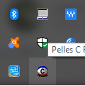

# TrayIcon

A Win32 C Lang Program to show a tray icon.

## Description
Contributed to http://www.smorgasbordet.com/pellesc/ Project.

Shamelessly stolen from ICZELION'S ASSEMBLER TUTORIAL                    

http://www.interq.or.jp/chubu/r6/masm32/tute/tute001.html

This example was converted to PellesC from lesson 24 off  ICZELION'S ASSEMBLER TUTORIAL, definitively a must for anyone involved in Windows Programming                                                      

I recommed reading lesson 24 to understand waths happening here, don't worry if you don't handle assembler, is not necessary to grasp the concepts...															
## Screen Shot

## Thanks to...																															

  - Iczelion for his awesome tutorial ....																	
  - Pelles Orinius for Pelles C			
